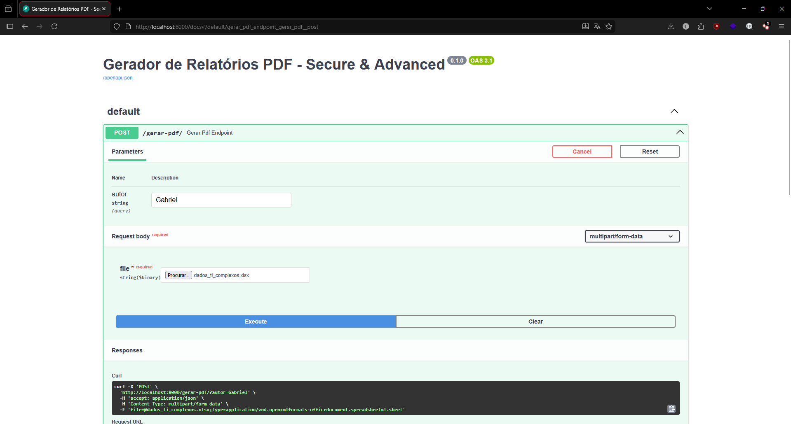

# 📊 Gerador de Relatórios Financeiros Fullstack (PDF + Email)

> Uma solução completa que transforma dados de Excel em relatórios executivos, com interface web moderna, envio automático por e-mail e processamento de dados em Python.


## 📝 Visão Geral

Este projeto é uma aplicação **Fullstack** (Backend + Frontend) desenvolvida para automatizar a rotina de análise financeira. 

O sistema oferece uma **Interface Web Responsiva** onde o usuário faz o upload de uma planilha Excel (`.xlsx`). O backend processa os dados (ETL), gera gráficos de tendências, compila um PDF profissional e entrega o resultado via **Download Direto** ou **E-mail automático** (SMTP).

O foco foi criar uma arquitetura segura, desacoplada (Background Tasks) e containerizada.

## 🚀 Funcionalidades Principais

* **Frontend Moderno (UI):**
    * Interface web construída com **HTML5** e **TailwindCSS**.
    * Feedback visual de processamento em tempo real.
    * Design responsivo e amigável.
* **Processamento de Dados (Data Science):**
    * Cálculo automático de KPIs (Faturamento, Ticket Médio, Top Produtos).
    * Análise temporal (tendência de vendas semanais com `pandas.resample`).
    * Geração de gráficos de barras e linhas com **Matplotlib**.
* **Engenharia de Backend:**
    * API assíncrona com **FastAPI**.
    * **Envio de E-mail:** Integração SMTP com `fastapi-mail` rodando em background para não travar a interface.
    * **Segurança:** Uso de variáveis de ambiente (`.env`) para proteção de credenciais e validação rigorosa de MIME Types.
* **DevOps:**
    * Containerização completa com **Docker** (imagem Linux Debian-slim otimizada para WeasyPrint).

## 🛠️ Tech Stack

* **Backend:** Python 3.9, FastAPI, Uvicorn
* **Frontend:** HTML5, JavaScript (Fetch API), TailwindCSS
* **Data & Viz:** Pandas, Matplotlib
* **PDF Engine:** WeasyPrint + Jinja2 Templates
* **Infraestrutura:** Docker
* **Segurança:** Python-Dotenv

## ⚙️ Como Executar

### Pré-requisito: Configuração de Ambiente (.env)

Para que o envio de e-mail funcione, crie um arquivo chamado `.env` na raiz do projeto e configure suas credenciais SMTP (ex: Senha de App do Gmail):

```ini
MAIL_USERNAME=seu_email@gmail.com
MAIL_PASSWORD=sua_senha_de_app
MAIL_FROM=seu_email@gmail.com
MAIL_PORT=587
MAIL_SERVER=smtp.gmail.com
```
Opção 1: Via Docker (Recomendado)

O projeto possui um Dockerfile que resolve todas as dependências do sistema Linux.

Construa a imagem:
    Bash

      docker build -t gerador-pdf .

Rode o container:
Bash

    docker run -p 8000:8000 --env-file .env gerador-pdf

   Acesse a Interface Web em: http://localhost:8000

Opção 2: Localmente (Windows/Linux)

Instale as dependências:
    Bash

      pip install -r requirements.txt

Execute o servidor:
Bash

    python api.py

## 📸 Demonstração
Nova Interface Web

Relatório PDF Gerado



## 📂 Estrutura do Projeto
Plaintext

      /
      ├── api.py             # Backend (Endpoints, Lógica de Email e Dados)
      ├── ui.html            # Frontend (Interface Gráfica com Tailwind)
      ├── template.html      # Layout do Relatório PDF (Jinja2)
      ├── Dockerfile         # Configuração da imagem Docker
      ├── requirements.txt   # Dependências do Python
      └── .env               # Arquivo de Variáveis (NÃO COMITAR)

Desenvolvido por Gabriel 💻
